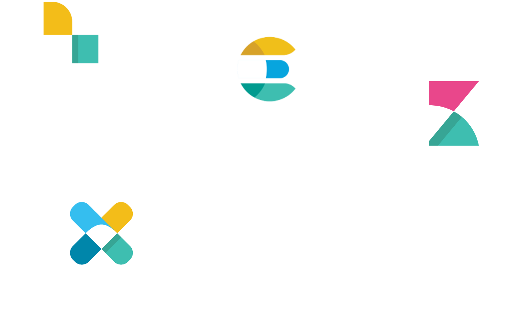

## Ceph

---

## ELK

---

## openSUSE

+ filesystems:ceph look into Subprojects
+ security:logging  

It works  
Leap 42.2, Tumbleweed as well as in Docker container

---

## Logging

+ *rsyslog*, *syslog-ng* to forward logs to Logstash
+ Ceph has Graylog (GELF) support  
+ store logs for later use
+ analyze logs for Alerting (Kibana, X-Pack)
+ trouble shooting/postmortem analyzing
+ predict issues with [Machine Learning](https://www.elastic.co/products/x-pack/machine-learning)

--

### Forwarding Logs

+ you can format your logs before forwarding
+ there is a tutorial for *rsyslog* how to reformat to GELF
+ Logstash has a lot of input modules
  + `syslog { }`
  + `graylog { }`

--

### Ceph GELF

+ to forward logs in GELF, update ceph.conf
  + `log_to_graylog = true`
  + `log_graylog_host = 127.0.0.1`
  + `log_graylog_port = 12201`
+ restart ceph services
+ or use [DeepSea](https://github.com/suse/deepsea)
  + has support for custom Ceph config options ([b435612](https://github.com/SUSE/DeepSea/commit/b435612))
    + `salt '*' state.apply ceph.configuration`
  + could restart services 
    + `salt-run state.orch ceph.restart`

--

### Parse and manage

+ Logstash provides methods to parse logs
+ simple alerting could be done with Logstash
+ use `grok { }` and other Filters of Logstash
  + to add fields
  + better indexing and managing your data
+ [Ceph Logstash example](https://github.com/irq0/ceph-tools/blob/master/logstash/logstash.conf)

---

## ELK cluster

+ use openSUSE ELK for traditional IT
+ use Docker on openSUSE for ELK
  + there are projects for full cluster (docker-elk, elk-docker)
  + as well as Kubernetes

---

## RGW
+ Object storage client to the ceph cluster, exposes a S3 & Swift API

---
### RGW
+ Also implments user accounts, acls 
+ heavy ecosystem of s3/swift client tooling can be leveraged against RGW
+ From Jewel we support multisite which allows geographical redundancy, 
 
--

## RGW Metadata search with ES
### Motivation
+ Objects have metadata associated with them that is often interesting to analyze
+ Since it is an "object storage" you don't have any traditional filesystems tool at your disposal
+ No du, df & friends, and either way these are hard on a dist. storage system

--

### Motivation
+ Some existing support with admin API, however the problems with this:
- returns specific metadata, not ideal for aggregation
- no notifications when new objects/buckets/accounts are created
- also permissions for users to access the admin API is tricky, since admin API was meant for administering
+ As an storage administrator you'd be interested in finding out for eg. the top 10 users, average object size etc., no of objects held on a user account etc.

--

## Design
+ Built atop of the multisite architecture, where metadata forwarding was already impelmented
+ Requires multiple RGWs and multiple  zones
+ A zone is made read only and essentially forwards metadata to configured ES cluster, this zone will not service any metadata
+ essentially gets metadata from other zones and pushes them to ES, deletion is also handled automatically
+ We have an attribute mentioning owners for an object and this is used to service user req,.
+ ES unfortunately doesn't have an off the shelf authentication module, so RGWs in other zones can actually query metadata and service user requests (since user auth is handled by RGW)

--

## Example Queries
- Average object size in the cluster, by user etc.
- total uploads over the last {week,hour,month...}
- more interesting usecases in future using object metadata and custom
  elastic fields

--

## Status in OpenSUSE
- openSUSE Factory: we already have Luminous (Ceph 12.0.2), 42.3, TW
- devel package: Filesystems:Ceph

#Backup Slides

### Multisite 
+ Disaster Recovery, CDN kind of usecase 
<section data-background-color="#ffffff">

</section>

--

### Multisite
+ Zone -> local ceph cluster, with one or many RGWs, one of the zones needs to be master eg. aws us-east-1
  Data is replicated across zones bidirectionally, metadata always relies on master zone
+ Zonegroups -> collection of zones, zonegroups only share metadata among them
